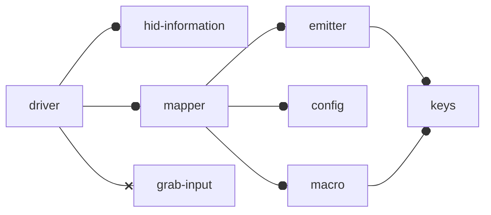

# hid-mapper-sample
This is a proof of concept (POC) project with code to override the default hid functionality of [human interface devices (HID)](docs/human-interface-device.md) on Linux.

It enables keyboard macros via configuration as code. Currently yaml configuration are supported but other format parsers can be added. 

## Process
1. Create yaml map configuration file `<device>.map.yaml`
2. Create Generic Driver Profile configuration file `<device>.profile.yaml` (not implemented yet) 
2. Start Driver with configuration(s) `./generic-linux-driver <device>.profile.yaml <device>.map.yaml` (not implemented yet)


> Currently only the non generic [g600-linux-driver](#g600-linux-driver) is implemented.
> The name `generic-linux-driver` is bad... Will change later... 


It [Grabs the HID input device](docs/grab-input.md) (Other devices wont be able to use the grabbed device) and remaps the keys to any key macro defined in [linux/input-event-codes.h](https://github.com/torvalds/linux/blob/master/include/uapi/linux/input-event-codes.h). 



See [diagrams](docs/diagrams.md) for more information. 


# Note:

* > This software is still in a pre-alpha state and should be treated as unstable. 
  > The use of said software is for non mission critical applications.

* > This software has `not been tested against anti cheat software`. As such you might get booted or banned for cheating as this creating virtual input.

# Table of contents
* [Local Development](#local-development)
  * [Setup (Aptitude)](#setup-aptitude)
  * [Source](#source)
  * [Compiling](#compiling)
    * [G600](#g600)
    * [Generic](#generic)
* [Usage](#usage)
  * [G600](#g600-linux-driver)
* [Configuration](#configuration)
  * [map](#map)

# Development Docs
* [Diagrams](docs/diagrams.md)
* [HID](docs/human-interface-device.md)
* [Input Grabbing](docs/grab-input.md)


[↥ TOP ↥](#hid-mapper-sample)


# Local Development  

For local development configuration for [vscode](https://code.visualstudio.com/) with the [c/c++ extension](https://marketplace.visualstudio.com/items?itemName=ms-vscode.cpptools) is provided for debugging.

## Setup (Aptitude)

* `build-essential` gcc compiler and make tools (llvm might work but have not tested)
* `git` to pull source code to local computer
* `libyaml-dev` is needed to read from yaml files 


``` bash
sudo apt-get update
sudo apt-get install build-essential git libyaml-dev
```

## Source
Cloning repository syntax into folder
```
git clone --recurse-submodules https://github.com/bluemner/hid-mapper-sample
```

## Compiling

### G600
To compile code unique to g600 run the command
```bash
make g600
```

### Generic 
> Generic is not yet implemented 


[↥ TOP ↥](#hid-mapper-sample)
# Usage

Logitech G600 sample that the generic code will be based off of.


You will need the following libs that are compiled with the application 
> Make sure you do git clone recursive to pull the [libhid-descriptor](https://github.com/bluemner/libhid-descriptor) source!

* `lib.hid.descriptor.so`
* `lib.hid.rawlinux.so`

## g600-linux-driver

> Not sure about calling this a "driver" but for now it will do... 

To run compile the code then run the binary file `g600-linux-driver`. The program will need sudo permissions to grab the device. You could also setup an input group that has permissions to grab a device. 

```bash
sudo ./g600-linux-driver configs/g600.map.yaml
```

Press `control + c` to quit. 

The code also has necessary signal captures for:

```c
signal(SIGINT, stop);
signal(SIGTERM, stop);
signal(SIGQUIT, stop);
signal(SIGABRT, stop); 
```

So systemd scripts should work. 


[↥ TOP ↥](#hid-mapper-sample)
# Configuration
G600 example config: [configs/g600.map.yaml](configs/g600.map.yaml)
## Map

Version: `1.0.0.alpha`
> This format may be subject to change

```yaml
---
#
# Configuration will map to the linux name of each button
# Example G7 is KEY_MACRO7 in input-event
#
bagpipe:
  name: "Logitech Gaming Mouse G600"
  description: "Sample profile"
  vendor:  "Logitech"
  product: "G600"
  #
  # ID Section can be found on linux at
  # /sys/class/input/input*/id
  # replace * with number 
  #
  bustype_id: 0x0003 # hex
  product_id: 0x1025 # hex
  vendor_id:  0x046d # hex
  version_id: 0x0111 # hex

  buttons:
    - key: "BTN_LEFT" # Key you want to watch
      press: "+BTN_LEFT" # On key press action
      release: "-BTN_LEFT" # On key press release
      modifier: false # if set to true all other fields but key will be ignored
      modifier_press: # if modifier is held and key pressed
      modifier_release: # if modifier is held and key released
```
[↥ TOP ↥](#hid-mapper-sample)
