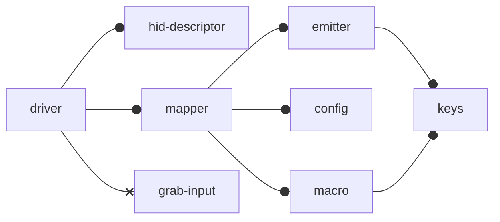
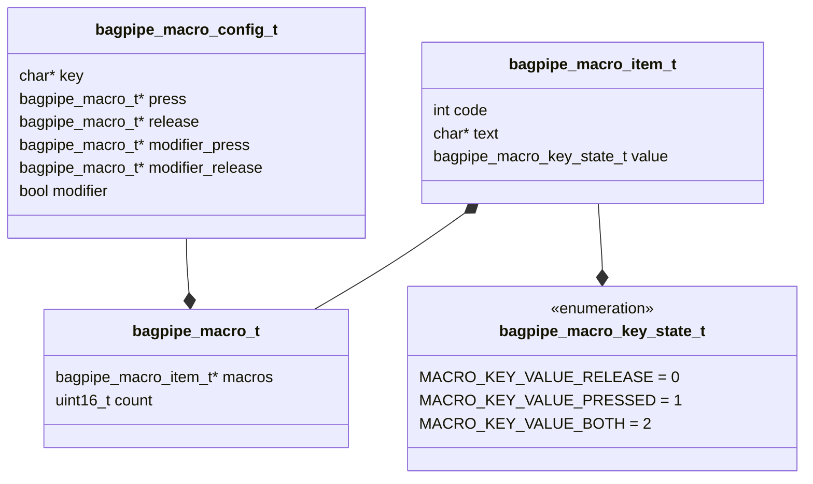
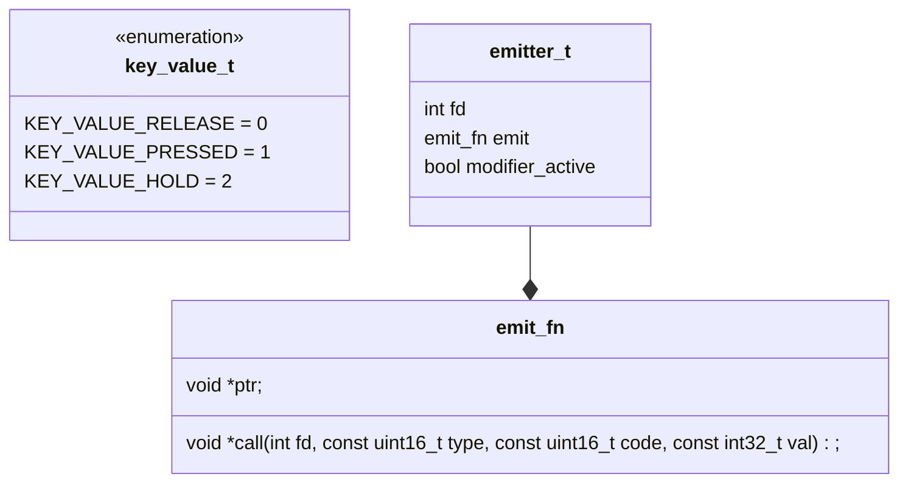
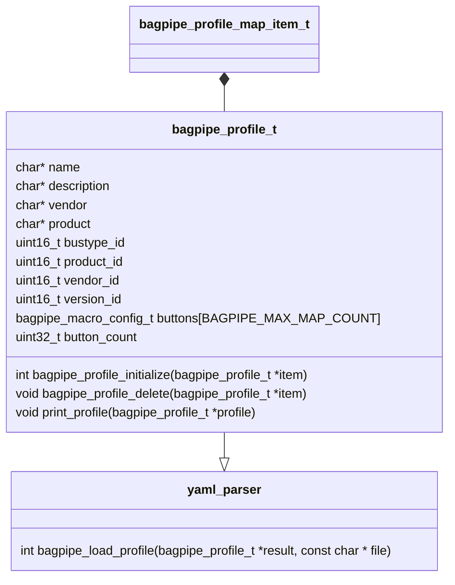

# Diagrams
* [Overview](#overview)
* [Keys](#keys)
* [Macro](#macro)
* [Emitter](#emitter)
* [Mapper](#mapper)
* [Config](#config)

# Overview

[↥ TOP ↥](#diagrams)

# Keys
Gets the linux key codes and names and checks the validity of the keys

[↥ TOP ↥](#diagrams)
# Macro
Loads text based macros for program that simulate button functionality this will map a key press to the correct macro state. 

* `KEY_MACRO11` this is pressed than release
* `+KEY_MACRO11` this is pressed
* `-KEY_MACRO11` this is release

```yaml
    key: "BTN_LEFT" 
    press: "+BTN_LEFT"
    release: "-BTN_LEFT"
    modifier: false # if set to true all other fields but key will be ignored
    modifier_press: null
    modifier_release: null
```



[↥ TOP ↥](#diagrams)

# Emitter
An [emitter](source/emitter.c) logic implements the linux [uinput module](https://www.kernel.org/doc/html/v4.12/input/uinput.html) and send virtual keyboard codes.



call takes 

* `event type` from [input-event-codes.h](https://github.com/torvalds/linux/blob/master/include/uapi/linux/input-event-codes.h)

* `key code` from [input-event-codes.h](https://github.com/torvalds/linux/blob/master/include/uapi/linux/input-event-codes.h)
* `val` from `key_value_t` for the state

[↥ TOP ↥](#diagrams)

# Mapper

Mapper takes the `emitter` and `profile` and creates a mask (`bagpipe_button_mask_t`) to map off of.

The mask contains a list `bagpipe_macro_config_t` which can be passed into the emitter. 


```c
typedef struct bagpipe_button_mask
{
  union {
    uint8_t  uint8;
    uint16_t uint16;
    uint32_t uint32;
    uint64_t uint64;
  } bitmask;
  uint8_t mask_size;
  uint32_t INPUT_EVENT_CODE; // <linux/input-event-codes.h>
  char * INPUT_EVENT_TEXT;
  bagpipe_macro_config_t *macro_config;
} bagpipe_button_mask_t;

typedef union map_fn
{
    void *ptr;
    int (*call) (mapper_t *mapper, const bagpipe_button_mask_t *button, key_value_t value);
} map_fn;

typedef struct mapper{
    bagpipe_profile_t *profile;
    map_fn map;
    emitter_t *emitter;
} mapper_t;
```

when creating a mapper instance you can map to two functions 

```c
void map(mapper_t *mapper, const bagpipe_button_mask_t *button, key_value_t value);
void no_map(mapper_t *mapper, const bagpipe_button_mask_t *button, key_value_t value);
```

`map` will run the mapping logic
`no map` will just fire the default key value. This was added for future use of enabled profiles.


[↥ TOP ↥](#diagrams)
# Config

The objective of the config is to load a config from say yaml into the `bagpipe_profile_t` structure.

Buttons ins the config will be created to macros


[↥ TOP ↥](#diagrams)
